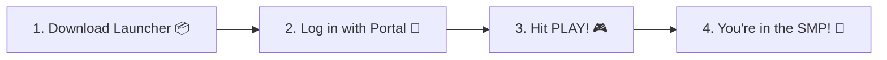

# ⚡ Lampas Launcher

> **The zero-braincells, 1-click way to play Lampas SMP.**  
> No Prism, no CurseForge, no *"hey why is my mod version different than the server"* pain. Just click **PLAY** and jump straight in! 🚀

[](https://github.com/justbecauseph/lampas-launcher/releases/latest)

---

## 🎮 What is this?

Welcome to the **Lampas Launcher**! It is our custom-built desktop app that handles *everything* so you can spend less time fixing crashes and more time building dirt huts, dying to creepers, and having fun on Lampas SMP.

### ✨ Why you'll love it:

* 🟢 **1-Click Login**: Log in with your browser. It automatically checks your Discord whitelist, hooks up your Minecraft account, and you're ready to go.
* 📦 **Auto-Magic Mod Updates**: Whenever the server gets new mods, updates, or configs, your launcher updates them automatically before the game starts. Zero drift, zero headache.
* ☕ **No Java? No Problem**: Minecraft 26.2 needs Java 25. Don't have it? Don't even know what Java is? The launcher will download and install the official Java runtime for you automatically in the background.
* ⚡ **Quick Play (Auto-Connect)**: Hit **PLAY** and the game boots straight into the Lampas server. No typing server IPs or clicking through multiplayer menus.
* 🎨 **Brings Your Resource Packs**: Required server resource packs are downloaded and turned on for you automatically. Your custom packs and settings stay completely untouched.
* 🧩 **Add Your Own Mods**: Want your favorite zoom mod, shader pack, or HUD tweaks? Just drag and drop them into the **Client Mods** tab!
* 👀 **Live Server Status**: Check if the server is online and see who's currently playing before you even launch the game.
* 💽 **Ran out of C: Drive space?**: You can move your entire game folder to your D: drive (or anywhere else) right from the settings without breaking anything.
* 🔧 **Big Red "Repair" Button**: Game acting weird? Press **Repair** and the launcher will scan, verify, and fix every file in seconds.

---

## 📥 How to Install & Play

Getting started takes about 30 seconds:



1. **Download the latest release**:
   * Grab the installer from [**GitHub Releases (Latest)**](https://github.com/justbecauseph/lampas-launcher/releases/latest).
   * **Windows**: Download `LampasLauncher-Setup-<version>.exe` (Installer) or `LampasLauncher-<version>-Windows.exe` (Portable).
   * **Linux**: Download `LampasLauncher-<version>-Linux.AppImage` (make executable & run) or `.tar.gz`.
2. **Log in**:
   * Click **Login with Lampas Portal**.
   * Your browser will open. Authorize your account, link your Minecraft username, and boom — you're logged in!
3. **Hit PLAY**:
   * The launcher will grab the newest mods, prepare Java, and launch Minecraft straight into Lampas.

---

## 🕹️ Launcher Tour

| Tab | What it's for |
|---|---|
| **🚀 Play** | The main dashboard. See server status, who's online, pick your channel (`Stable`, `Beta`, `Dev`), and press the big **PLAY** button. |
| **🧩 Client Mods** | Toggle official optional mods or drop your own `.jar` files here. |
| **📜 Console** | Live logs while your game is running. If something goes wrong, you can search and copy errors here to send to staff. |
| **⚙️ Settings** | Allocate more RAM (slider), change game directory, customize Java settings, or view your logs. |

---

## ❓ FAQ & Troubleshooting

### 🛑 "It says my Minecraft account isn't bound!"
Head over to the [Lampas Portal](https://dev.lampas.town) dashboard, link your Minecraft Java username to your account, and hit login again in the launcher!

### 💥 "My game crashed or won't start!"
1. Click the **Repair** button on the Play tab. This checks every single file against the server and replaces anything that broke.
2. If it still crashes, head to the **Console** tab, click **Copy Logs**, and paste them in the Discord `#support` channel!

### 💾 "Will updating delete my worlds, screenshots, or keybinds?"
**Nope!** Your `saves/`, `screenshots/`, `logs/`, `servers.dat`, and custom `options.txt` settings are strictly protected and will never be overwritten or deleted.

---

## 🤓 For Nerds & Developers

If you want to build or tinker with the launcher code locally:

### Requirements
* [Bun](https://bun.sh) (v1.0+)
* [Node.js](https://nodejs.org) (v20+)

### Quick Commands
```bash
# 1. Install dependencies
bun install

# 2. Run in development mode (TypeScript watch + Electron)
bun run dev

# 3. Run all tests
bun test

# 4. Package for your OS
bun run package:win    # Windows installer & portable exe
bun run package:linux  # Linux AppImage & tar.gz
```

---

## 📄 License

This project is licensed under the [Apache License 2.0](LICENSE).

* **Source Code:** Licensed under [Apache-2.0](LICENSE).
* **Branding & Assets:** Lampas logos, art assets, and server branding are proprietary and reserved by Lampas SMP / Lampas Tech Team.
* **Game Assets & Mods:** Mod binaries, Minecraft runtime components, and game assets belong to their respective creators.

*NOT AN OFFICIAL MINECRAFT PRODUCT. NOT APPROVED BY OR ASSOCIATED WITH MOJANG OR MICROSOFT.*
